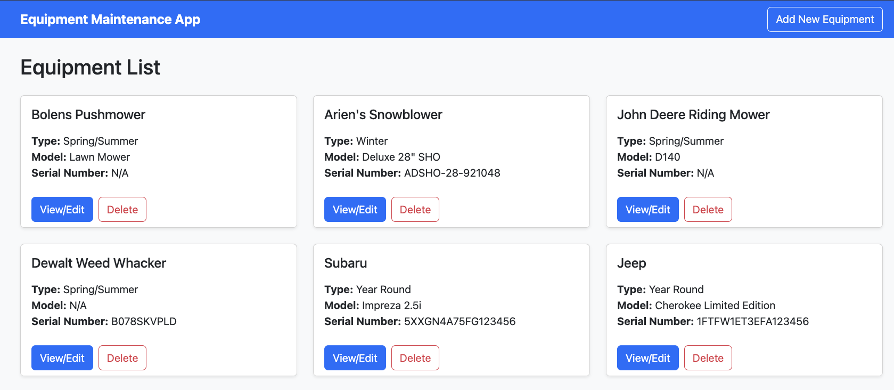
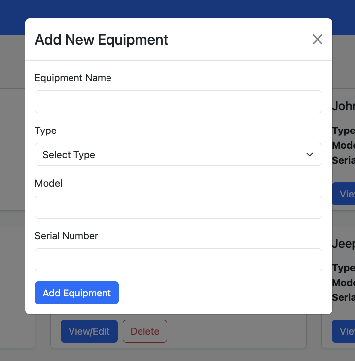
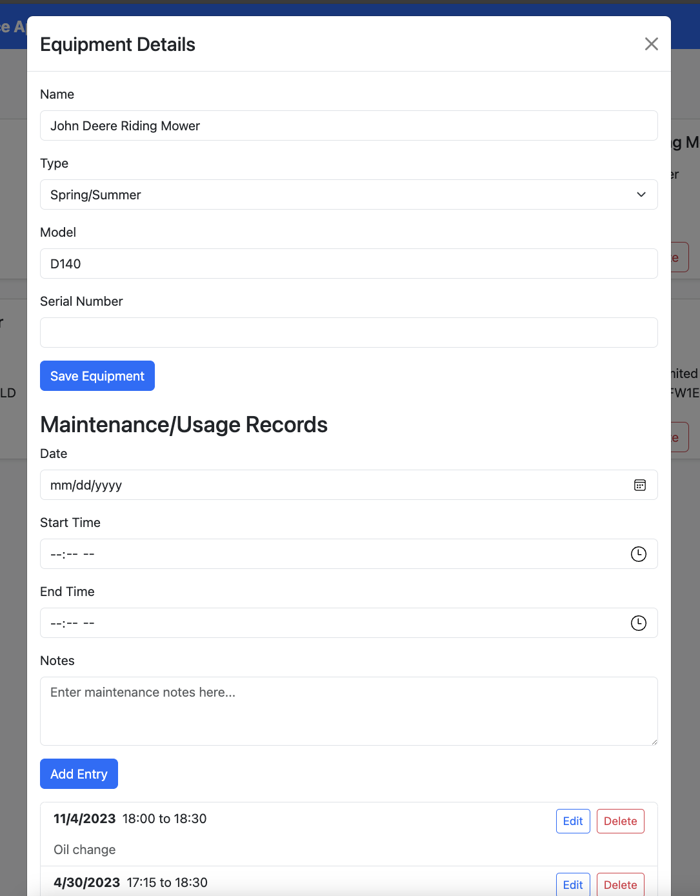

# Equipment Maintenance App

## Overview
The Equipment Maintenance App is a web-based application designed to help manage equipment inventory and maintenance schedules.

## Features
- Equipment inventory management
- Maintenance record keeping
- Responsive design for desktop and mobile use

## Technologies Used
- Frontend: React.js, React Bootstrap
- Backend: Node.js, Express.js
- Database: MongoDB

## Installation
1. Clone the repository
2. Navigate to the project directory
3. Install dependencies:
   ```
   cd frontend
   npm install
   cd ../backend
   npm install
   ```
4. Set up environment variables (see `.env` files in frontend and backend directories)
5. Start the backend server:
   ```
   cd backend
   node server.js
   ```
6. Start the frontend development server:
   ```
   cd frontend
   npm run dev
   ```

## Usage
Final project for CSC6210 - This web app allows for the user to add, edit, delete, and view equipment and maintenance records.

## Screenshots
### Equipment List


### Add Equipment Modal


### Maintenance/Usage Details



